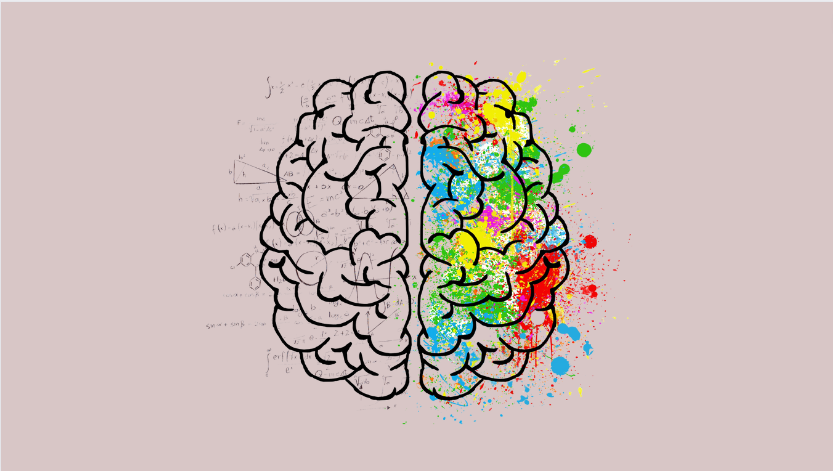
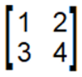
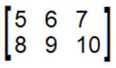
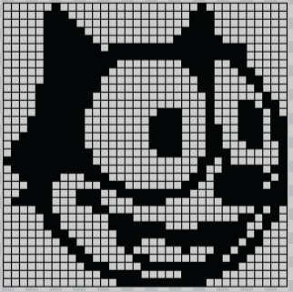

# Brain Tumor Classification

Technology is in a constant state of advance, lucky for us mortals we can use these tools to improve medical devices and hopefully our overall quality of life.  
In this project I have applied Machine Learning algorithms to identify brain tumors within MRI scans.

# Primer

If you have no experience using machine learning this section is for you. Here I will generalize some basic concepts so that hopefully you can read through the 
rest of this document with minimal head scratches.

First lets understand our data, which is about 3000 photos of brain MRIs.  
'How does the computer look at these photos?' you might ask.  
The simple answer is matrices, a matrix simplified is just a square or rectangular box filled with numbers visualized below is a simple 2x3 matrix.  
 

 
 
Now, if you have ever dealt with photo sizes, or screen settings, you may recall measurements like 1920x1080 for your computer screen, or dimension of 
digital photos like 150x150.   
Lets take those picture dimensions (150x150) as an example

The photograph is 150 pixels wide by 150 tall. Which means there is 22,500 pixels within this picture!  
If we imagine the the picture dimesions as a large matrix with each pixel being a number, we are now looking at it similar to the way a computer would!  
Each number specifying what color the pixel should be, thus creating a digital photograph! visualization below  \
 

 
The computer will be able to learn patterns within the matrix of numbers with Machine learning algorithms,
and be able to identify objects, people, animals and much more!

# Model Building

The Convolutional Neural Network (CNN) is a subtype of Neural Networks that is mainly used for applications in image and speech recognition. 
Its built-in convolutional layer reduces the high dimensionality of images without losing its information. 
That is why CNNs are especially suited for this use case.

Since this dataset is relatively small, our neural network does not have much to learn on.
So we'll use Transfer Learning to train the model to save computational time and get accurate results.

The step by step process for the code is within in the 'notebooks' folder.
I started with a baseline CNN to compare results with the model built with transfer learning.

models and preprocessed data are stores the 'saves' directory within the repo

# Summary/Moving Forward

With the final model built with the Effnet pretained state of the art model, we were able to classify the brain tumor images with 99.97% accuracy

