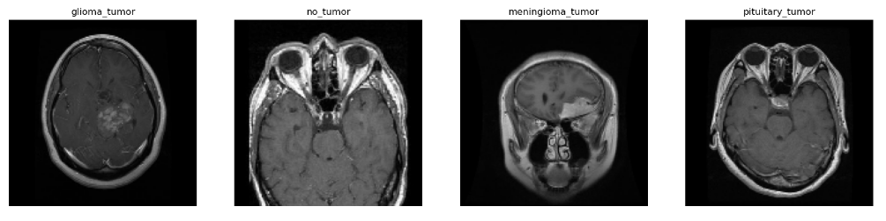
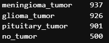
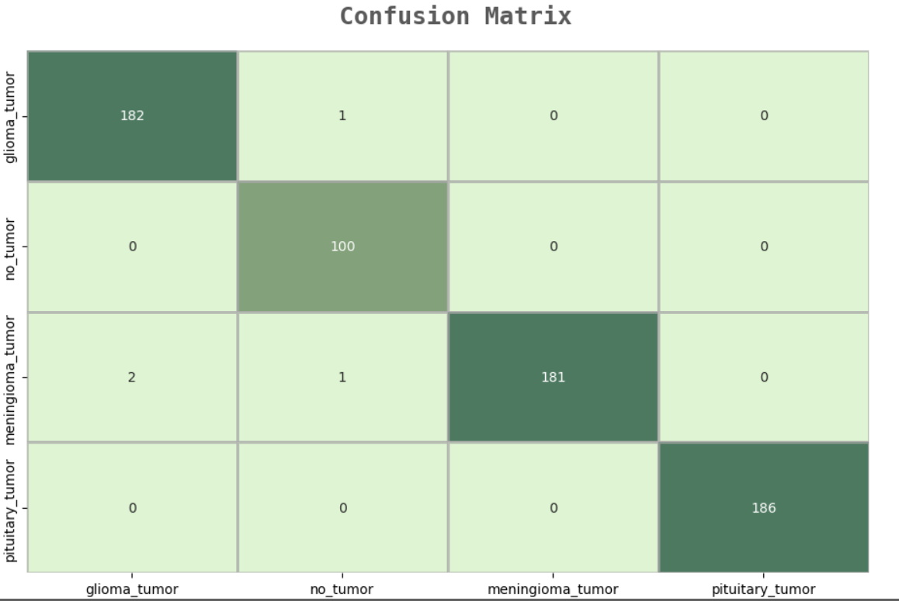

# Brain Tumor Classification

Goal: The goal for this project is too accurately classify tumors within a MRI scan, or identify that there is no tumor at all. 

In today’s medical field, technology plays a big role when it comes to patient care. 

We have LOADS of medical data in the world it makes it a great target for a Data Scientist to apply their skills too.

# EDA

Beggining with some exploratory data analysis, where we do some investigating to further understand our data

Our data is comprised of about 3000 MRI scans

The dimensions being (150, 150, 3) for each of these photos

The data set is mostly balanced besides the 'no_tumor' labels are shy, though I do not see our network having issues with this

# Model Building

The [Convolutional Neural Network (CNN)](https://towardsdatascience.com/a-comprehensive-guide-to-convolutional-neural-networks-the-eli5-way-3bd2b1164a53) is a subtype of Neural Network that is mainly used for applications in image and speech recognition. 

Its built-in convolutional layer reduces the high dimensionality of images without losing its information, making CNNs well suited for this use case.

Since this dataset is relatively small, our neural network does not have much to learn on.
So we'll use Transfer Learning to train the model to save computational time and get accurate results.

The step by step process for the code is within in the 'notebooks' folder.
I started with a baseline CNN to compare results with the model built with transfer learning.

models and preprocessed data are stored in the 'saves' directory

# Summary/Moving Forward

With the final model built with the Effnet pretained state of the art model, we were able to classify the brain tumor images with 99.97% accuracy on our small dataset and save a lot of processing time as well.

